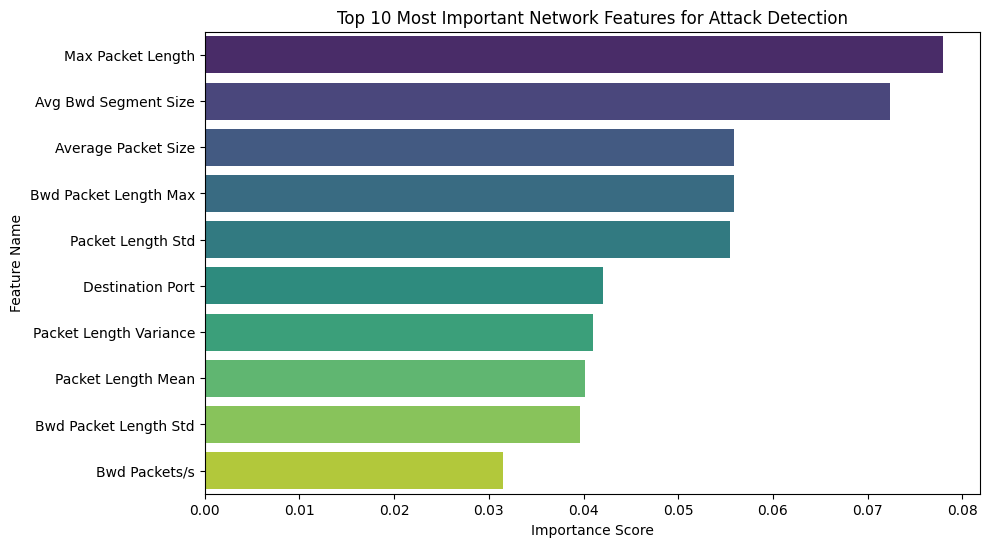

# Real-Time Network Intrusion Detection System (NIDS)
**Integrating Machine Learning with Live Network Telemetry**

##  Academic Purpose
Developed as a core technical project to demonstrate competency in **Big Data processing** and **Real-Time Systems**. This project serves as a foundation for my transition into graduate-level research in **Computer Vision and Robotics**, specifically focusing on securing machine-to-machine communication.

##  The Pipeline
This project is contained within a single comprehensive Jupyter Notebook, covering:
1.  **Data Engineering:** Cleaning ~700,000 flows from the **CICIDS2017** dataset, handling high-cardinality features, and resolving infinity/NaN values.
2.  **Machine Learning:** Training a **Random Forest Classifier** with an overall accuracy of **99.94%**.
3.  **Interpretability:** Utilizing Feature Importance to identify specific behavioral indicators for DDoS and DoS attacks.
4.  **Live Deployment:** Using the **Scapy** library to sniff live traffic and apply the pre-trained model for real-time anomaly detection.

##  Performance Metrics
| Attack Category | Precision | Recall | F1-Score |
| :--- | :--- | :--- | :--- |
| **Benign** | 1.00 | 1.00 | 1.00 |
| **DoS/DDoS** | 1.00 | 1.00 | 1.00 |
| **Heartbleed** | 1.00 | 1.00 | 1.00 |

##  Visual Insights: Feature Importance
A key part of this project was identifying *why* the model flags certain traffic. As shown in the graph below, **Max Packet Length** and **Avg Bwd Segment Size** were the most critical features for distinguishing malicious traffic from benign user activity.

##  Tech Stack
*   **Modeling:** Scikit-learn (Random Forest), Pandas, NumPy
*   **Networking:** Scapy (Packet Sniffing & Injection)
*   **Visualization:** Matplotlib, Seaborn
*   **Deployment:** Joblib (Model Serialization)

##  How to Use
1.  **Data:** Due to GitHub's size limits, the raw 1GB CSV is excluded. Use the included `.pkl` files for instant testing.
2.  **Environment:** Ensure `scapy` and `joblib` are installed.
3.  **Live Monitoring:** Run the final cells in the notebook to start the real-time detection engine.
1.  **Data:** Due to GitHub's size limits, the raw 1GB CSV is excluded. Use the included `.pkl` files for instant testing.
2.  **Environment:** Ensure `scapy` and `joblib` are installed.
3.  **Live Monitoring:** Run the final cells in the notebook to start the real-time detection engine.
